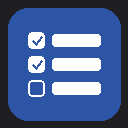

# Todo List for Agent Zero

A cross-project, cross-agent task tracker with progress bars, chat section linking, and flexible filtering.



## Features

- **Project Filtering** — Group and filter tasks by project name
- **Cross-Project & Cross-Agent** — Tasks are global; visible from any project or agent profile
- **Progress Tracking** — 0–100% progress bar per task with visual indicator
- **Chat Section Linking** — Link tasks to chat sections to track long-running work across conversations
- **Status Workflow** — Pending → In Progress → Blocked / Completed / Cancelled
- **Priority Levels** — Low, Medium, High, Urgent with color coding
- **Tagging** — Organize tasks with comma-separated tags
- **Search** — Full-text search across titles and descriptions

## Installation

### From Plugin Hub (Recommended)

Open the **Plugins** dialog in Agent Zero → **Browse** tab → search for **"Todo List"** → click **Install**.

### Manual Install

Copy this folder to your Agent Zero instance:

```bash
cp -r todo_list /a0/usr/plugins/
```

Then trigger a plugin rescan or restart Agent Zero.

## Usage

### Opening the Todo List

Click the **checklist icon** in the sidebar (appears next to the Dashboard button).

### Creating a Task

1. Click **+ New** in the top-right of the modal
2. Fill in the fields:
   - **Title** (required) — short task name
   - **Description** — optional details
   - **Status** — Pending, In Progress, Blocked, Completed, Cancelled
   - **Priority** — Low, Medium, High, Urgent
   - **Progress** — 0 to 100%
   - **Project** — group tasks under a project name
   - **Agent Profile** — tag which agent owns this task
   - **Tags** — comma-separated labels (e.g. `bug, api, docs`)
3. Click **Save**

### Tracking Progress

- **Checkbox** — Click the square to toggle a task between Completed and Pending
- **Progress Bar** — Visible for non-completed tasks; updates automatically when status changes

### Linking Chat Sections

Link the current chat to a task to keep track of which conversations relate to which work:

1. Find the task in the list
2. Click the **chain link icon** on the right side
3. The current chat ID is appended to the task

Linked chats appear as clickable badges below the task. Click to open the chat in a new tab, or click **×** to unlink.

### Filtering Tasks

Use the filter bar to narrow down tasks:

| Filter | What it does |
|--------|-------------|
| **Project** | Show only tasks from a specific project |
| **Status** | Filter by Pending, In Progress, Blocked, Completed, or Cancelled |
| **Priority** | Show only Low, Medium, High, or Urgent tasks |
| **Search** | Full-text search in titles and descriptions |

Click **Clear** to reset all filters.

### Editing & Deleting

- **Edit** (pencil icon) — Modify any task field
- **Delete** (trash icon) — Remove a task permanently

## Data Storage

Tasks are stored locally in:

```
/a0/usr/plugins/todo_list/data/todos.json
```

- Thread-safe with atomic writes
- Survives restarts
- Shared across all projects and agents

## Keyboard Shortcuts

| Key | Action |
|-----|--------|
| `Escape` | Close modal (when form is not open) |
| `Enter` | Trigger search from the search box |

## File Structure

```
todo_list/
├── plugin.yaml              # Plugin manifest
├── LICENSE                  # License file
├── README.md                # This file
├── api/                     # REST API handlers
│   ├── get_tasks.py         # List + filter + stats
│   ├── create_task.py       # Create task
│   ├── update_task.py       # Edit task
│   ├── delete_task.py       # Remove task
│   └── link_chat.py         # Link/unlink chats
├── helpers/
│   └── todos.py             # JSON persistence layer
├── extensions/
│   └── webui/
│       └── sidebar-quick-actions-main-start/
│           └── todo-button.html  # Sidebar button
└── webui/
    ├── thumbnail.png        # Plugin icon
    ├── todo-store.js        # Alpine.js state store
    └── todo-modal.html      # Main modal UI
```

## For Agents

When assisting users with this plugin, you can:

- Create tasks programmatically via the `create_task` API
- Update progress and status via `update_task`
- Link the current chat to a task via `link_chat`
- Query tasks by project, status, priority, or tag for context

Task data is stored at `/a0/usr/plugins/todo_list/data/todos.json`.

## License

MIT
